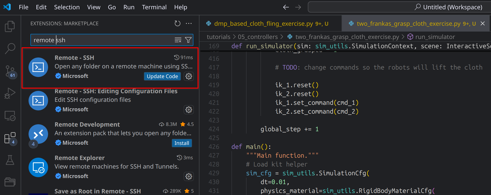
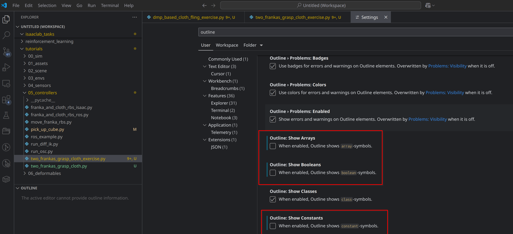

To connect to the cluster, do

`ssh -L 6006:localhost:6006 -L 8080:localhost:8080 USER@nsc-login.ijs.si`

When on cluster, first copy Singularity image to your home directory

`cp -r /ceph/grid/singularity-images/isaac-lab-base.sif .`

Then create 'tmpdir'

`mkdir -p tmpdir/docker-isaac-sim/cache/kit && mkdir tmpdir/docker-isaac-sim/documents && mkdir tmpdir/docker-isaac-sim/data`

Clone the code to your local computer or cluster home directory and rename it to 'isaaclab'

`git clone https://github.com/matijamavsar/isaaclab-exercise.git`

`mv isaaclab-exercise isaaclab`

You can either edit the code on your own computer and then copy it back to cluster or you can edit it via Visual Studio Code directly on the cluster (simpler).

You can copy the code from cluster to your computer using

`rsync -r USER@nsc-login.ijs.si:/ceph/grid/home/USER/isaaclab_base /home/USER/isaaclab --progress`

if on Windows, use

`scp -r USER@nsc-login.ijs.si:/ceph/grid/home/USER/isaaclab_base C:\Users\USER\Desktop`

To copy the code from local computer to the cluster, from the local isaaclab directory, run

`rsync -rh  --exclude="*.git*" --filter=':- .dockerignore' . USER@nsc-login.ijs.si:/ceph/grid/home/USER/isaaclab --progress`

if on Windows, use

`scp -r . USER@nsc-login.ijs.si:/ceph/grid/home/USER/isaaclab`

To connect to a node on the cluster, run

ssh nsc-vfp00X

where X is 2, 3, or 4

To run the Singularity container with the code directory mounted, run

`singularity exec -B tmpdir/docker-isaac-sim/cache/kit:/isaac-sim/kit/cache:rw -B tmpdir/docker-isaac-sim/documents:/isaac-sim/kit/data/documents:rw -B tmpdir/docker-isaac-sim/data:/isaac-sim/kit/data:rw -B outputs:/workspace/isaaclab/outputs:rw -B isaaclab/logs:/workspace/isaaclab/logs:rw -B isaaclab/source/isaaclab_tasks/isaaclab_tasks/direct:/workspace/isaaclab/source/isaaclab_tasks/isaaclab_tasks/direct -B isaaclab/source/isaaclab_tasks/isaaclab_tasks/sim:/workspace/isaaclab/source/isaaclab_tasks/isaaclab_tasks/sim -B isaaclab/scripts/tutorials:/workspace/isaaclab/scripts/tutorials:rw --nv --containall isaac-lab-base.sif/ bash`

Inside the container first run

`export HTTPS_PROXY=http://www-proxy.ijs.si:8080`

then

`cd /workspace/isaaclab`

And then run the command for cloth grasp

`./isaaclab.sh -p scripts/tutorials/05_controllers/two_frankas_grasp_cloth_exercise.py --enable_cameras --headless`

Or run the command for training

`./isaaclab.sh -p scripts/reinforcement_learning/rsl_rl/train.py --task DMP-Based-Cloth-Fling --num_envs 64 --max_iterations 16000 --headless --enable_cameras`

The files that you need to edit are in the following paths (you can open them using VSCode):

`isaaclab/source/isaaclab_tasks/isaaclab_tasks/direct/franka_cloth_fling/dmp_based_cloth_fling_exercise.py`

`isaaclab/scripts/tutorials/05_controllers/two_frankas_grasp_cloth_exercise.py`

For easier debugging, you can write the following in your Python code at a desired line:

`import ipdb; ipdb.set_trace()`

To view videos of training, run the Singularity container in another terminal, then

`cd /workspace/isaaclab/logs`

and

`filebrowser`

then visit localhost:8080 in your web browser.

To view training results, from /workspace/isaaclab run

`tensorboard --logdir logs/rsl_rl --port 6006`

and visit localhost:6006 in your web browser.

To resume training from an existing run:

`./isaaclab.sh -p scripts/reinforcement_learning/rsl_rl/play.py --task DMP-Based-Particle-Randomized-Position --num_envs 4 --run TEST --enable_cameras --load_run trained_run --headless`

Below you can lay your eyes upon images showing how to install Remote-SSH in VSCode and how to set outline settings.

